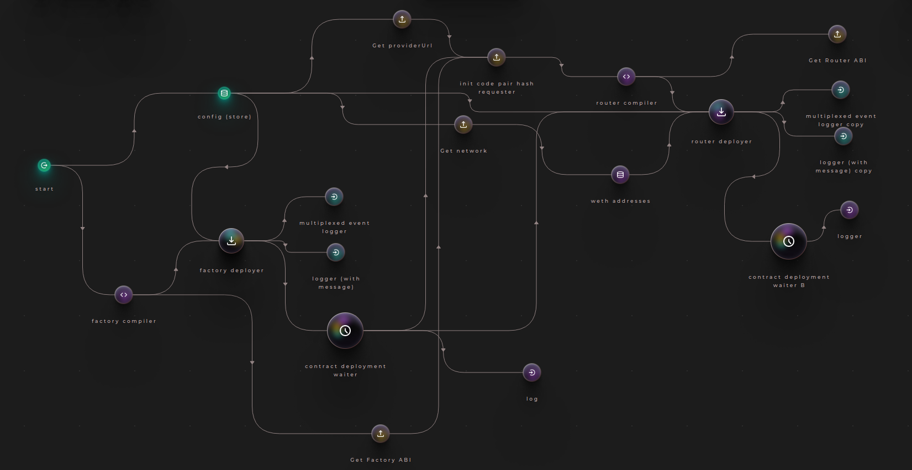
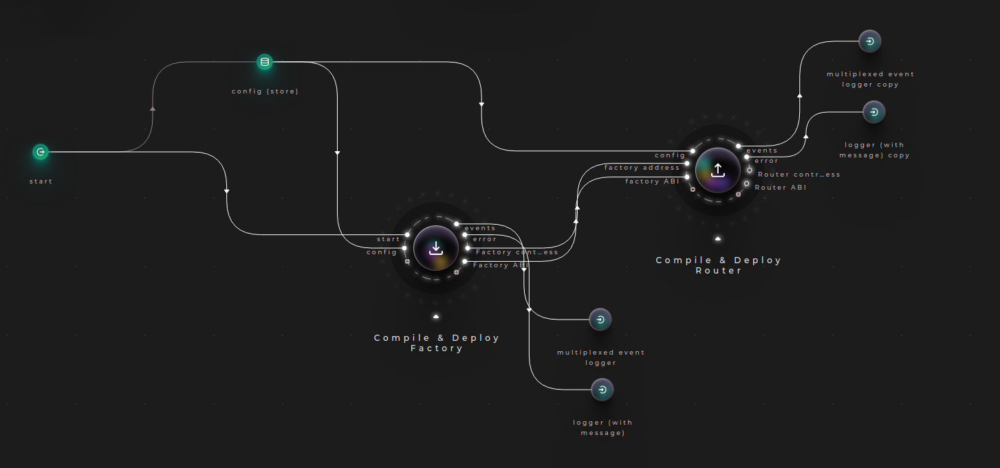
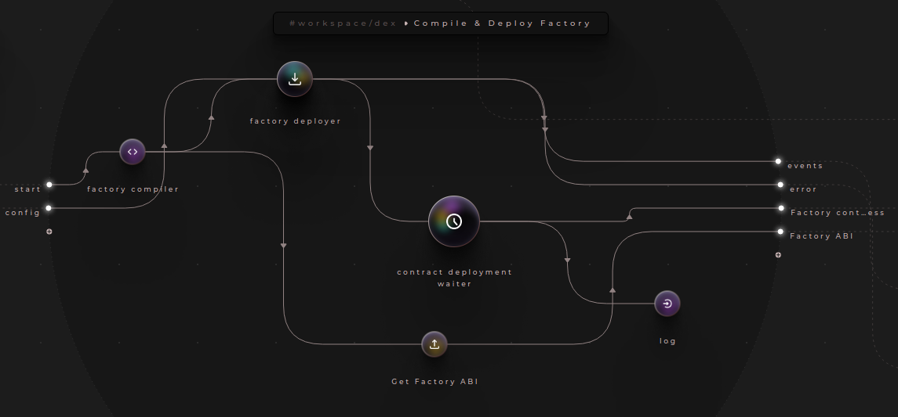
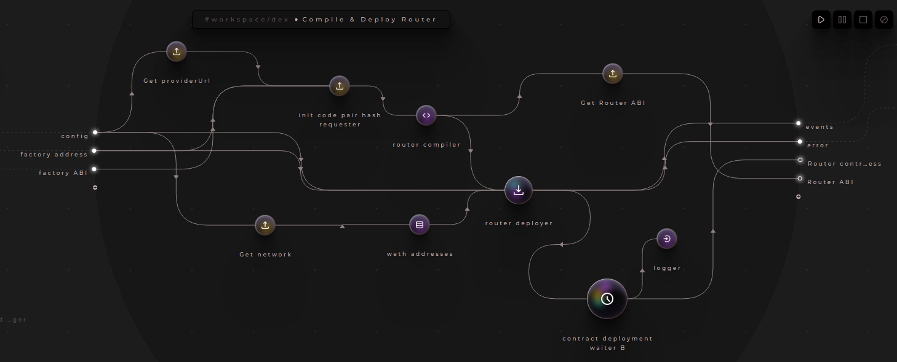

# Frameworks used
CRANQ - https://cranq.io/
CRANQ is the graphical and intuitive IDE designed for discovery, and re-use of existing code and smart contracts.

CRANQ nodes imported:
- Uniswap compilers
    - Factory compiler: Compiles UniswapV2Factory contract
    - Router compiler: Compiles UniswapV2Router02 contract
- Uniswap Deployers:
    - Factory deployer: Deployes UniswapV2Factory contract to the chain
    - Router deployer: Deployes UniswapV2Router02 contract to the chain
- Store: Stores data and sends it via data when read. When the store is empty, any attempt to read the contents will result in a signal sent out via not found
    !Please note that the preferred approach is to use system environment variables!
    - in the "data" input we enter these value pairs:
        - Factory Deployer needs the following object:
        ``` json
        {
            "providerUrl": string,
            "privateKey": string,
            "accountAddress": string
        }
        ```
        So we add the following value to the "data" input of store:
        ``` json
        {
            "providerUrl": "[Provider url to Goerli testnet]",
            "privateKey": "[The private key of the account that will deploy]",
            "accountAddress": "[The address of the account that will deploy]",
            "network": "goerli"
        }
        ```
        provideUrl is offered using Alchemy Developer Platform connecting with the Goerli Ethereum Testnet

We can now connect the output "data" of store to the input "config" of the Factory Deployer node.
For the outputs of the Factory deployer:
    - we'll connect a Multiplexed event logger for "events"
    - Logger with message for "error"
    - log terminal node

Run the CRANQ nodes and the Factory contract will be deployed

We can add an intermediary node between Factory deployer and log which is the "contract deployment waiter":
 - input: "confirmation" output of Factory deployer
 - output: "address" of the contract and it will become the new input of log

Overview of the CRANQ state machine:


Grouping correlated nodes:


Compile & Deploy Factory:


Compile & Deploy Router:
