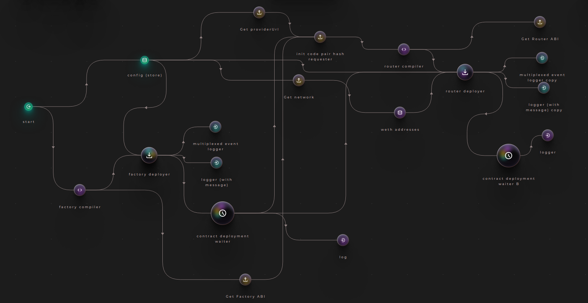
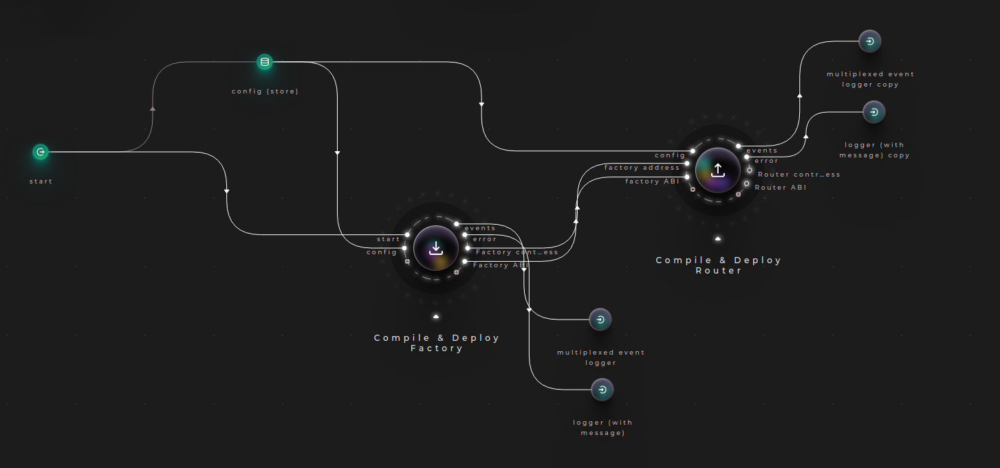
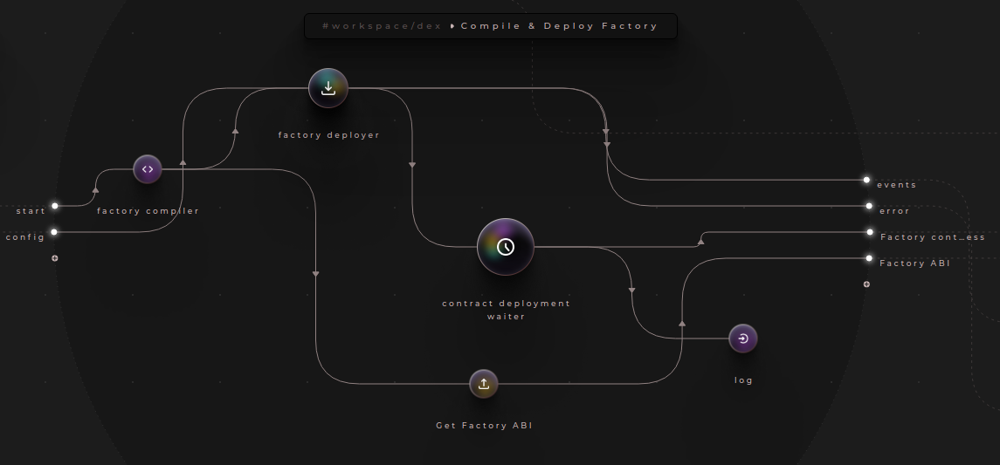
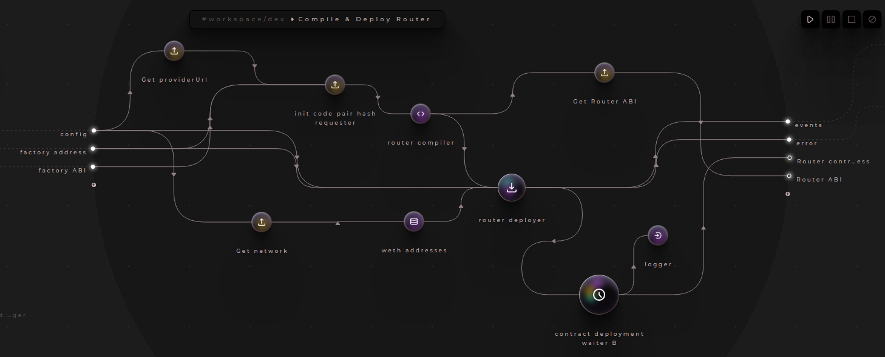
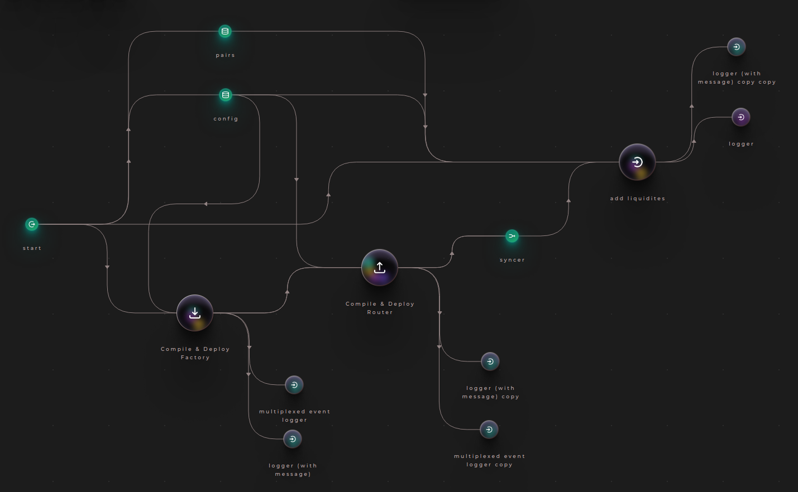
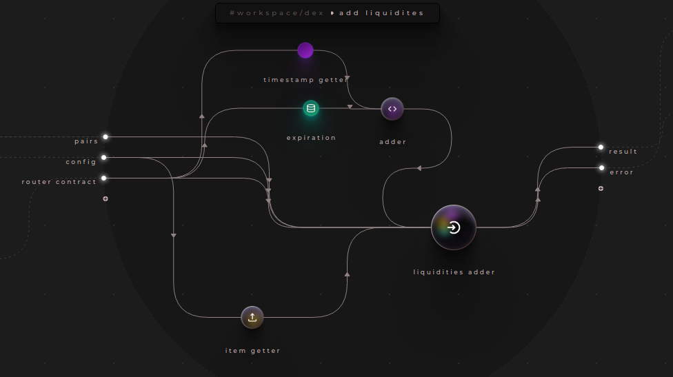

# Frameworks used
CRANQ - https://cranq.io/
CRANQ is the graphical and intuitive IDE designed for discovery, and re-use of existing code and smart contracts.

CRANQ nodes imported:
- Uniswap compilers
    - Factory compiler: Compiles UniswapV2Factory contract
    - Router compiler: Compiles UniswapV2Router02 contract
- Uniswap Deployers:
    - Factory deployer: Deployes UniswapV2Factory contract to the chain
    - Router deployer: Deployes UniswapV2Router02 contract to the chain
- Store: Stores data and sends it via data when read. When the store is empty, any attempt to read the contents will result in a signal sent out via not found
    !Please note that the preferred approach is to use system environment variables!
    - in the "data" input we enter these value pairs:
        - Factory Deployer needs the following object:
        ``` json
        {
            "providerUrl": string,
            "privateKey": string,
            "accountAddress": string
        }
        ```
        So we add the following value to the "data" input of store:
        ``` json
        {
            "providerUrl": "[Provider url to Goerli testnet]",
            "privateKey": "[The private key of the account that will deploy]",
            "accountAddress": "[The address of the account that will deploy]",
            "network": "goerli"
        }
        ```
        provideUrl is offered using Alchemy Developer Platform connecting with the Goerli Ethereum Testnet

We can now connect the output "data" of store to the input "config" of the Factory Deployer node.
For the outputs of the Factory deployer:
    - we'll connect a Multiplexed event logger for "events"
    - Logger with message for "error"
    - log terminal node

Run the CRANQ nodes and the Factory contract will be deployed

We can add an intermediary node between Factory deployer and log which is the "contract deployment waiter":
 - input: "confirmation" output of Factory deployer
 - output: "address" of the contract and it will become the new input of log

Overview of the CRANQ state machine:


Grouping correlated nodes:


Compile & Deploy Factory:


Compile & Deploy Router:


Next step is to provide liquidity:

Add a "liquidities adder" node in CRANQ (used to Add liquidity to multiple pools):
    - in input we have:
        - "deadline": Transaction deadline is used to set a time after which a transaction can no longer be executed. This limits the "free option" problem, where Ethereum miners can hold signed transactions and execute them based off market movements. We'll specify the deadline timestamp using another "store" node and specifying as data value: 300 (which is 300 seconds - 5 minutes):
            - We need to sum the current timestamp with 300 seconds using the "adder" node
        - "router contract" expects the router address and the router abi. We need to use a "syncer" node to combine those two variables in one object to send to the liquidities adder node input "router contract"
        - "pairs": the 2 pairs of the liquidity pool. We will use another store node
        - "credentials" needs information from our "config" node
        - "to address" will be retrieved from the "config" node too

After deploying some ERC20 Testnet tokens that will be available in liquidity pools we can setup the liquidity pairs:
Liquidity pairs: we will store the liquidity pairs in another "store" node with value:
``` json
//Array of arrays. Each child array has 2 objects representing the pair of tokens in the pool.
[
    [
        {
            "address": "0x47b9566081ddee5f180e82fd36d60e93d15af96f", //PIERO token https://goerli.etherscan.io/token/0x47b9566081ddee5f180e82fd36d60e93d15af96f
            "desiredAmount": 1000 
        },
        {
            "address": "ETH",
            "desiredAmount": 0.001 //1000 testnet PIERO token will initially be worth 0.001 GoerliETH and viceversa
        }
    ],
    [
        {
            "address": "0x47b9566081ddee5f180e82fd36d60e93d15af96f", //PIERO token https://goerli.etherscan.io/token/0x47b9566081ddee5f180e82fd36d60e93d15af96f
            "desiredAmount": 1000 
        },
        {
            "address": "0xF92e1d5e04f944B2Bc07CA58DD1932102c093f80", //ATOM token https://goerli.etherscan.io/token/0xf92e1d5e04f944b2bc07ca58dd1932102c093f80
            "desiredAmount": 10
        }
    ],
    [
        {
            "address": "0xF92e1d5e04f944B2Bc07CA58DD1932102c093f80", //ATOM token https://goerli.etherscan.io/token/0xf92e1d5e04f944b2bc07ca58dd1932102c093f80
            "desiredAmount": 1000
        },
        {
            "address": "0xB91f927602C19e678eb95DF25f5f0D6dAB887142", //UNI token https://goerli.etherscan.io/token/0xB91f927602C19e678eb95DF25f5f0D6dAB887142
            "desiredAmount": 500
        }
    ]
]
```
Now we can connect the pair store to the "pairs"

Finally, we can deploy everything, all transactions performed on the Goerli testnet can be seen in the history of this address: 
https://goerli.etherscan.io/address/0xcc9e28840ea61c6bd6bf755ba22709b3da9ee617 (From block 	7628976 to block	7629134)

Complete overview:


add liquidities node:


Note: You can also import the CRANQ project directly from the "cranq-project" folder. Manage your config information in the "config" storage node once imported.

# DEX Front-end
Project structure will be created using useDApp: https://usedapp.io/

``` bash
yarn create eth-app ./
```
Add the following object under "workspaces" in the packages.json:

``` json
"resolutions":{
    "react-error-overlay": "6.0.9" //It fixes a bug regarding auto-updating of the react-app using eth-app
}
```
For custom CSS, Tailwind CDN is used (https://tailwindcss.com/docs/installation/play-cdn)

To run the application:
```
npm run react-app:start
```
Make sure NODE_OPTIONS=--openssl-legacy-provider
```
export NODE_OPTIONS=--openssl-legacy-provider
```
Router address and provider url need to be specified in the config.js in the root folder. Create the file with the following:
``` javascript
import { Goerli } from "@usedapp/core";

export const ROUTER_ADDRESS = "[YOUR ADDRESS HERE]"; 

export const DAPP_CONFIG = {
  readOnlyChainId: Goerli.chainId,
  readOnlyUrls: {
    [Goerli.chainId]: "[YOUR ALCHEMY/INFURA OR ANY RPC PROVIDER URL HERE]",
  },
};
```
